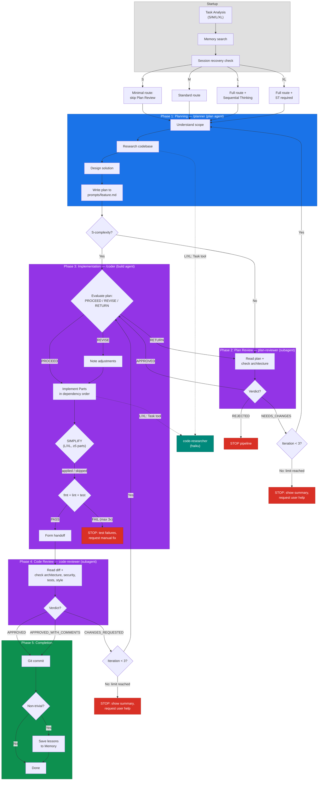
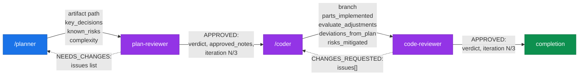
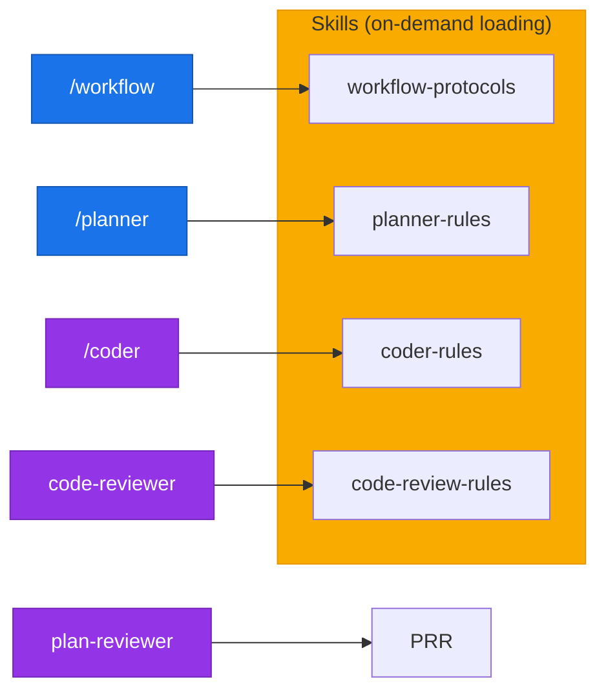

<p align="center">
  <strong>OpenCode Kit</strong><br/>
  Reusable configuration kit for <a href="https://opencode.ai">OpenCode</a>
</p>

<p align="center">
  
  
  
  
  
</p>

---

Structured multi-agent development workflow with built-in planning, implementation, and code review phases. Supports any language and framework — Go, Python, TypeScript, Rust, Java, and 26 more via tree-sitter analysis.

---

## 📑 Table of Contents

- [⚡ Quick Start](#-quick-start)
- [🔧 Commands](#-commands)
- [🏗 Architecture](#-architecture)
- [🔌 MCP Servers](#-mcp-servers)
- [📂 Project Structure](#-project-structure)
- [📐 Conventions](#-conventions)

---

## ⚡ Quick Start

### Installation

```bash
curl -sL https://raw.githubusercontent.com/0rac1e/opencode-kit/refs/heads/main/install.sh | bash
```

### Update existing installation

```bash
curl -sL https://raw.githubusercontent.com/0rac1e/opencode-kit/refs/heads/main/install.sh | bash -s -- --update
```

### First Steps

```bash
# 1. Edit AGENTS.md — update Language Profile to match your project stack
# 2. Analyze codebase and generate PROJECT-KNOWLEDGE.md
/project-researcher

# 3. Validate configuration
/init
```

### Options

```bash
KIT_VERSION=v1.0.0 bash install.sh    # install specific version
INSTALL_DIR=/path/to/project bash install.sh --update   # install to specific directory
```

<details>
<summary>Manual Installation (advanced)</summary>

```bash
git clone https://github.com/hex0xdeadbeef/opencode-kit.git
cd opencode-kit
bash install.sh                        # install to current directory
bash install.sh --update               # update existing installation

# Or copy manually:
cp -r .opencode/ /path/to/your/project/
cp AGENTS.md /path/to/your/project/
cp opencode.json /path/to/your/project/
# Merge .gitignore manually
```

</details>

---

## 🔧 Commands

### `/workflow` — Full Development Cycle

The main command that orchestrates the entire development process. Executes all phases sequentially with user confirmation between steps.

**Pipeline:** `task-analysis` → `planner` → `plan-review` (agent) → `coder` → `code-review` (agent)

```bash
/workflow Add new REST endpoint for profiles
/workflow --auto Implement resource update         # autonomous mode, no confirmations
/workflow --from-phase 3                            # resume from specified phase
```

<details>
<summary>⚙️ Modes & Phases</summary>

**Modes:**

| Mode        | Flag             | Description                                |
| ----------- | ---------------- | ------------------------------------------ |
| Interactive | _(default)_      | Confirmation before each phase             |
| Autonomous  | `--auto`         | All phases automatically, no confirmations |
| Resume      | `--from-phase N` | Resume from specified phase                |

**Phases:**

| #   | Phase          | Description                                                                                         |
| --- | -------------- | --------------------------------------------------------------------------------------------------- |
| 1   | Task Analysis  | Complexity classification (S/M/L/XL) and route selection                                            |
| 1.5 | Design         | Requirements exploration + approach selection _(L/XL only, optional for M new_feature/integration)_ |
| 2   | Planning       | Codebase research, implementation plan creation                                                     |
| 3   | Plan Review    | Plan validation against architecture _(skipped for S-complexity)_                                   |
| 4   | Implementation | Code writing strictly per approved plan, running tests                                              |
| 5   | Code Review    | Change review: architecture, security, quality                                                      |
| 6   | Completion     | Git commit + lessons learned _(if non-trivial)_                                                     |

</details>

**Result:** implemented, tested, and reviewed code with a git commit.

---

### `/planner` — Implementation Planning

Researches the codebase and creates a detailed implementation plan with code examples and acceptance criteria. Does not modify project files.

```bash
/planner Add pagination to list endpoint
/planner --minimal Add field to model               # minimal plan without deep research
```

**Result:** plan file at `.opencode/prompts/{feature}.md`

---

### `/coder` — Code Implementation

Implements code strictly per approved plan. Runs formatting, linting, and tests after implementation.

```bash
/coder                          # auto-find plan in prompts/
/coder my-feature               # implement specific plan
```

**Result:** working code with passing tests + evaluate output with deviation documentation.

---

### `/project-researcher` — Project Analysis

Autonomous agent for deep codebase analysis: architecture, dependencies, and DB schema. Generates `PROJECT-KNOWLEDGE.md` used by other commands as context.

```bash
/project-researcher
```

---

### `/review-checklist` — Review Checklist Reference

Displays the code review checklist: architecture, security (OWASP), code quality, performance.

```bash
/review-checklist
```

---

### 🗺 Command Selection Guide

| Scenario                                        | Command               |
| ----------------------------------------------- | --------------------- |
| Full feature implementation from scratch        | `/workflow`           |
| Autonomous implementation without confirmations | `/workflow --auto`    |
| Need a plan before writing code                 | `/planner`            |
| Plan approved, need implementation              | `/coder`              |
| Setting up kit in a new project                 | `/init`               |
| Understand project structure                    | `/project-researcher` |

---

## 🏗 Architecture

The system is a **5-phase development pipeline** managed by the orchestrator (`/workflow`), which sequentially delegates work to specialized agents. Each agent has a strictly defined responsibility zone, model assignment, and skill set.

<details>
<summary>🔄 Development Pipeline</summary>



</details>

<details>
<summary>📨 Handoff Data Flow</summary>



</details>

<details>
<summary>📦 Skill Loading</summary>



</details>

### ⚙️ Model Routing

| Model      | Components                                                          | Purpose                                               |
| ---------- | ------------------------------------------------------------------- | ----------------------------------------------------- |
| **sonnet** | `/workflow`, `/planner`, `/coder`, `plan-reviewer`, `code-reviewer` | Deep reasoning, orchestration, implementation, review |
| **haiku**  | `code-researcher`                                                   | Fast read-only search                                 |

### 📊 Complexity Routing

| Complexity | Parts | Layers | Plan Review | Sequential Thinking | code-researcher |
| ---------- | ----- | ------ | ----------- | ------------------- | --------------- |
| **S**      | 1     | 1      | skip        | not needed          | skip            |
| **M**      | 2–3   | 2      | standard    | as needed           | skip            |
| **L**      | 4–6   | 3+     | standard    | recommended         | yes             |
| **XL**     | 7+    | 4+     | standard    | required            | yes             |

### 🔑 Key Principles

- **Sequential execution** — phases don't run in parallel
- **Handoff Protocol** — 4 typed payload contracts between phases
- **Context Isolation** — review phases run as isolated subagents (clean context, no authorship bias)
- **Loop Limits** — max 3 iterations per review cycle, then STOP and ask user
- **Checkpoint Protocol** — state saved after each phase for session recovery
- **Evaluate Protocol** — coder critically evaluates plan before implementation (PROCEED/REVISE/RETURN gate)
- **Conditional Deps Loading** — S-complexity skips heavy skill loading
- **Re-Routing** — pipeline adjusts route on complexity mismatch (downgrade/upgrade)

---

## 🔌 MCP Servers

Configure in `opencode.json`:

### Optional

| Server                | Package                   | Purpose                                |
| --------------------- | ------------------------- | -------------------------------------- |
| `sequential-thinking` | —                         | Structured reasoning for complex tasks |
| `context7`            | `@upstash/context7-mcp`   | Library documentation lookup           |
| `postgres`            | `@anthropic/mcp-postgres` | Required for `/db-explorer`            |

---

## 📂 Project Structure

```
.opencode/
├── agents/                # Autonomous agents
│   ├── plan-reviewer.md   # Plan validation agent (invoked by /workflow)
│   ├── code-reviewer.md   # Code review agent (invoked by /workflow)
│   └── code-researcher.md # Codebase exploration agent (hidden)
├── commands/              # Slash commands (/workflow, /planner, /coder, etc.)
├── skills/                # Reusable domain knowledge
│   ├── workflow-protocols/# Orchestration, handoff, checkpoints, re-routing
│   ├── planner-rules/     # Planning methodology, task analysis, data flow
│   ├── coder-rules/       # Implementation rules, evaluate protocol
│   └── code-review-rules/ # Security checklist (OWASP), review checklists
├── templates/             # Templates for creating new artifacts
├── prompts/               # Generated implementation plans
├── rules/                 # Cross-cutting constraints (architecture rules)
└── PROJECT-KNOWLEDGE.md   # Auto-generated project knowledge base

AGENTS.md                  # Project instructions (equivalent to CLAUDE.md)
opencode.json              # OpenCode configuration (permissions, agents, commands)
```

---

## 📐 Conventions

- Artifacts use YAML-first format (>80% YAML, minimal prose)
- Language: English for code, YAML keys, and artifact specs
- Size limits enforced by agents
- Examples use grep/glob patterns to find current code, not hardcoded snippets
- Commands use frontmatter for metadata (name, description, agent, model)
- Agents use frontmatter for configuration (name, description, mode, model, permissions)
